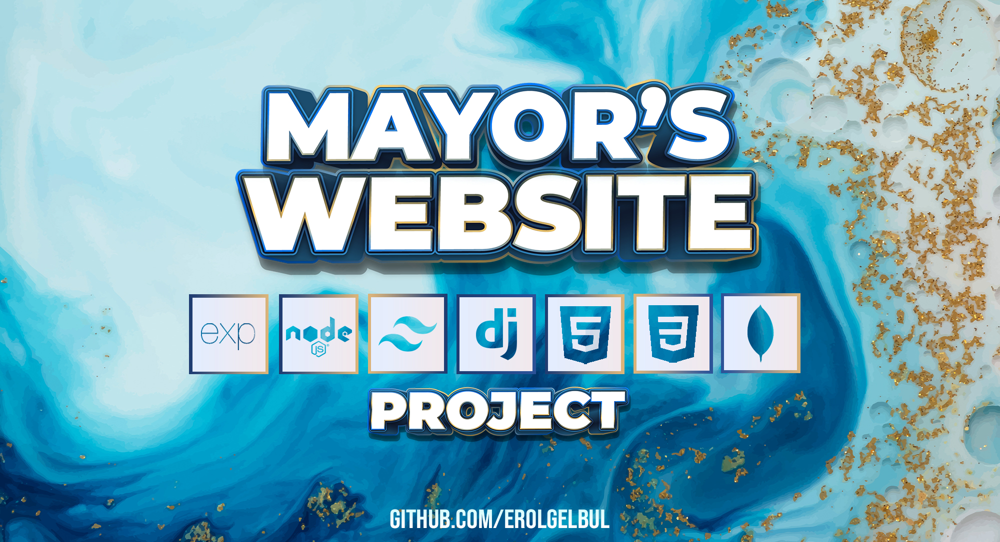
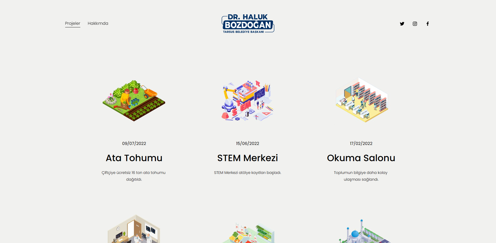
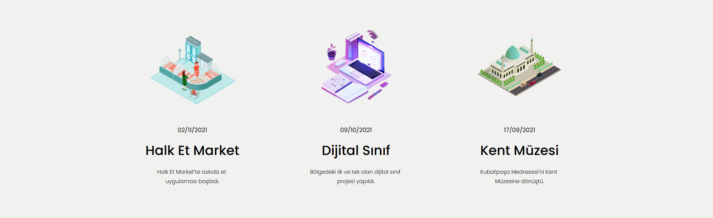
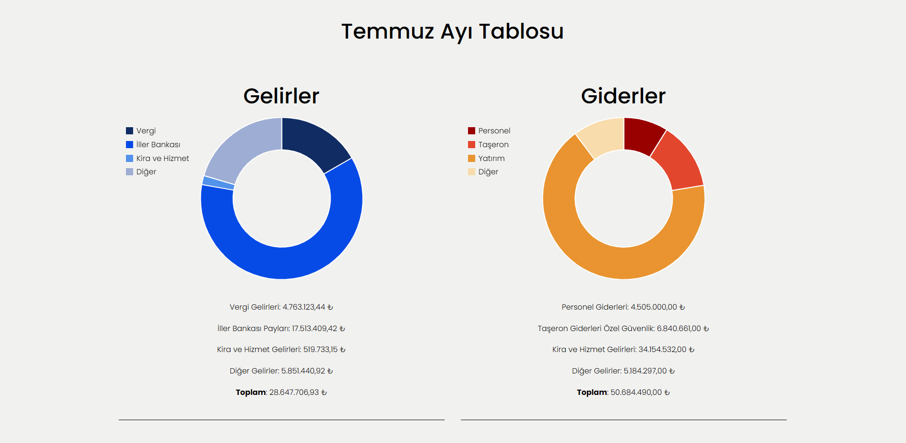
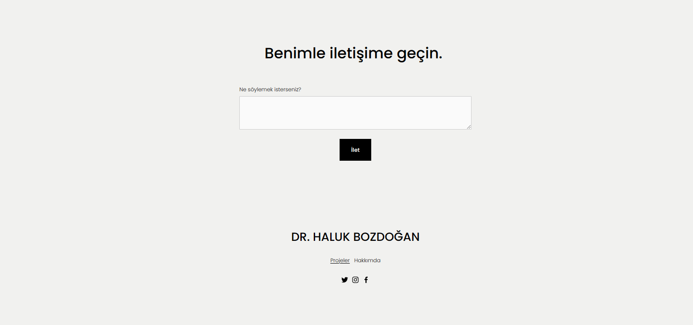
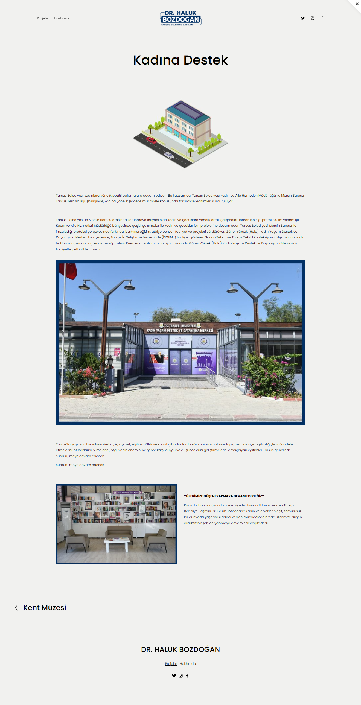

  

<!-- ABOUT THE PROJECT -->
## 1. Introduction

  

A personal website I designed & built for a mayor. Minimalistic, clean and easy to read.

<!-- HOW TO USE -->
## 2. Technologies

### 2.1 Front-end

- HTML5
- Tailwind CSS

### 2.2 Back-end

- MongoDB
- Node.js
- Express.js

## 3. Design

Works done:

  

Monthly income & expense report:

  

Contact section:

  

Post Page:

  

(<a href="#top">back to top</a>)

<!-- CONTACT -->
## Contact

Erol Gelbul - [Website](erolgelbul.com)

Project Link: [Mayor's Website](https://github.com/ErolGelbul/mayors_website)

(<a href="#top">back to top</a>)
